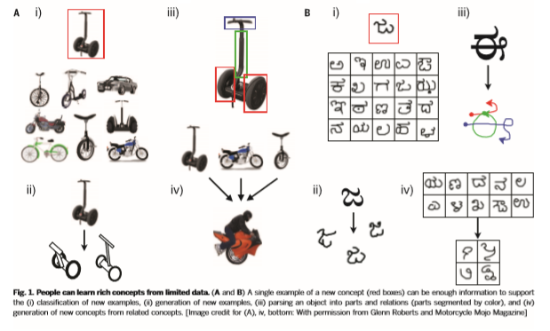

## 论文阅读

### [Human-level concept learning through probabilistic program induction](../slides/Science-2015-Lake-1332-8.pdf)[^1]

[^1]: [Lake, B. M., Salakhutdinov, R., and Tenenbaum, J. B. (2015). Human-level concept learning through probabilistic program induction.](http://www.sciencemag.org/content/350/6266/1332.short) _Science_, 350(6266), 1332-1338.

**概率算法归纳得人类级别的概念学习**曾登上了《科学》杂志的封面，三名分别离来自麻省理工学院、纽约大学和多伦多大学的研究者开发了一个“只看一眼就会写字”的系统。下面对该论文进行部分转述：

-----------------------------------

人们经常可以通过一个简单的例子来拓展学会一个新的概念，但是目前的机器学习算法却需要好几百的例子才能达到相似的准确度。人们形成一个新概念的渠道比机器要广泛，比如通过动作、图像、文字说明等。我们提出了一个能够在简单的视觉概念方面，即世界字符表的手写字符，媲美人类的学习能力的计算模型。本模型把概念描绘成基于贝叶斯理论对所给出的示例理解得最好的一段简单程序。在 one-shot 识别的任务中，本模型达到了人类级别的表现并且胜过了现在（2015）的深度学习算法。我们也提出了一些“图灵视觉测试”，来探查本模型针对一般情况的创造能力，而模型的这一能力在许多情况下与人类行为很难区分。

尽管人工智能和机器学习已经取得了巨大的进步，但是人类概念认识的两个方面还是无法被机器掌握。
首先，世界上存在无数自然和人造的事物，但**人们都可以从一个或者几个例子中就学习到新的概念，但机器学习算法却需要几十个甚至几百个类似的例子才可以达到类似的程度**。相反的，许多领先的机器学习都要通过海量的数据模型才可以理解概念，特别是取得新层次的对象和语音识别为基准的深度学习模型。其次，**人们学习的内容比机器更加丰富**，即使对象只是一个简单的概念（图B），除了理解，人们还可以做到更多，例如举一反三（图B1、B2），剖析对象整体和局部的关系（图B3），以及在现有类别的基础上再做分类（图B4）。人们可以从有限的数据中学习到丰富的概念。相比之下，就算是最好的分类机器也难以做到这些，通常是需要专门的算法才可以一一尝试。

当前，我们正在试图探究人类这两方面的学习方法：人们是怎样通过一两个例子就可以学习新概念的？人们是如何进行这样抽象、丰富、灵活的再加工的？当这两个问题叠加，又出现了新的挑战：如何基于如此简单的数据而产生丰富的加工成果？对于任何学习理论来说，越复杂的模型需要越多的数据，才可以达到良好的泛化，在新旧样本之间可以通用。尽管如此, 人们还是以惊人的敏捷性来驾驭这种权衡, 学习丰富的概念, 从稀疏的数据中很好地拓展。

这篇文章旨在介绍贝叶斯学习程序（BPL）框架，如何依靠简单的例子来对新概念进行学习和加工，这种学习方法的主体是人类。
概念被表示为简单的概率性程序，也就是说概率生成抽象描述语言的结构化程序。

本文介绍了贝叶斯程序学习 (BPL) 框架, 它能够从一个例子中学习大量的视觉概念, 并在本质上概括出大多与人无法区分的视觉概念。概念被表示为简单的概率程序, 即概率概率生成模型被表达为用一种抽象描述的语言的结构化的程式。

我们的框架汇集了三个关键信息：语意合成，因果关系，学会学习。作为程序, 丰富的概念可以从简单的原语 "组合" 构建。把简单的原语合成丰富的概念，称为“语意合成”，这个过程会排除掉一些多余杂乱的信息并创造有用的信息，然后根据抽象的“因果关系”来处理，生成类别概念。通过观察来构造程序模型，通过开发先验和根据经验来理解新概念，达到 BPL 的“学会学习”。简而言之，BPL 可以通过现有的碎片信息来重新加工，捕捉真实世界中的因果关系，重生成多层面的结果。

从 Omniglot 中抽取的简单视觉概念的任务来说明 BPL。手写字符非常合适用来比较人类和机器学习的差异，人类可以认知自然事物，并且都有自身常用的基准学习方法。然而，机器学习算法是通过评估成百上千的训练示例后才能进行分类和解析。我们还通过更有创造性的项目来区别人类和计算机分别生成的概念，采用三种不同的深度学习模型来做比较，包括两种不同的深卷积网络，但是我们发现他们需要更多的概率模型才能完成一次性的学习任务。

#### Bayesian Program Learning

BPL 方法学习简单的随机程序表达概念, 从部分 (图 3 A, iii)、子部分 (图 3 A, ii) 和空间关系 (图 3 a, iv) 中组合起来构建这些概念。BPL 定义了一个生成模型, 可以通过以新的方式组合零件和子部分对新类型的概念 ("A"、"B" 等) 进行采样。然后新型概念作为下次加工的基础，进行再次加工。

类型 $\psi$ 上的联合分布, 该类型的一组 $M$ token(笔画) type $\theta^{(1)}, \cdots, \theta^{(M)}$ 和对应的二值图片 $I^{(1)}, \cdots, I^{(M)}$：

$$
\begin{aligned}
&P(\psi, \theta^{(1)}, \ldots, \theta^{(M)}, I^{(1)}, \ldots, I^{(M)})\\
=& P(\psi)\prod_{m=1}^M P(I^{(m)}|\theta^{(m)})P(\theta^{(m)}|\psi)
\end{aligned}
$$

通过使用图像和笔划数据将每个条件分布拟合到 $30$ 个字母的背景字符集来 learn to learning, 此图像集还用于预训练替代的深层学习模型。生产出的新数据和新字符可以用到随后的再次加工任务中，为任务提供参考对象。

手写字符是一个抽象的模式，这个模式包括 parts,subparts,andrelations，而书写结构反映因果关系。